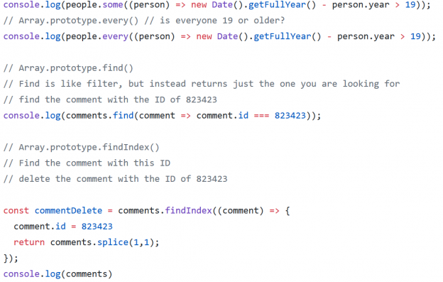

<h1 align="center">
 
  
   
     
  Array Cardio Day 2
   
</h1>

<h4 align="center">Array Methods</h4>

- The `.some()` method will test to see if at least one element in the array passes the given test – also returns `false` if applied to an empty array

- The `.every()` method tests to see if every element in the array passes the given test – returns `true` if applied to an empty array

- The `.find()` method returns the value of the first element in the array that passes the provided testing function – if no elements pass then `undefined` is returned